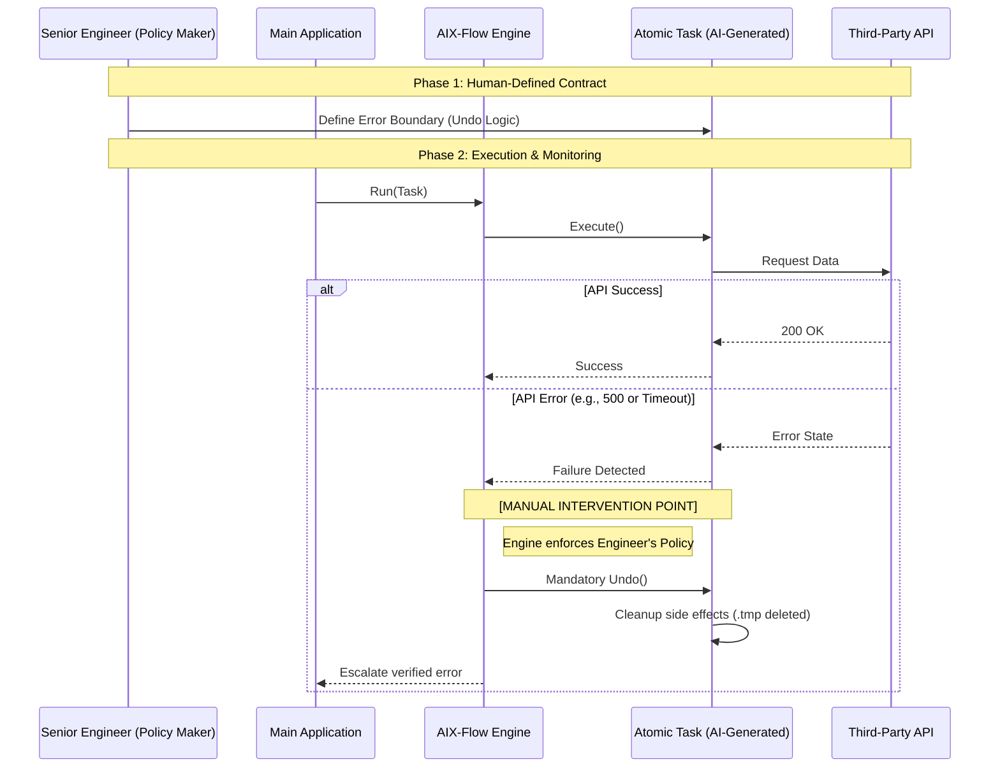

# Concurrent Chunk Downloader: Architectural Contract

This document defines the interaction contract for the Chunk Downloader. It emphasizes **Architectural Governance** over implementation details.

## 1. The Core Philosophy: AI-Native Resilience
In an environment where code is generated by AI agents, the primary risk is **Non-Deterministic Error Handling**. AI often fails to anticipate complex failure modes of third-party APIs (e.g., HTTP 429 Rate Limiting vs. 503 Service Unavailable).

**AIX-Flow** shifts the responsibility of error handling from the AI-generated code to a **Human-Defined Atomic Policy**:
- **Isolated Side Effects**: All I/O is redirected to `.tmp` files.
- **Deterministic Rollback**: Any failure triggers a mandatory, human-verified `Undo()`.
- **Manual Intervention Points**: Engineers define the "Critical Error Boundary" within the `Task` interface.

## 2. Sequence Diagram with Error Governance

## 3. Post-Processing Pipeline Contract
- **Compression**: Gzip (stream-based).
- **Encryption**: AES-256-CTR with random IV.
- **Integrity**: SHA-256 calculated on the fly.
- **Engineer's Duty**: The engineer must manually verify that the SHA-256 hashing covers the *entire* file stream to prevent partial integrity bypasses.
