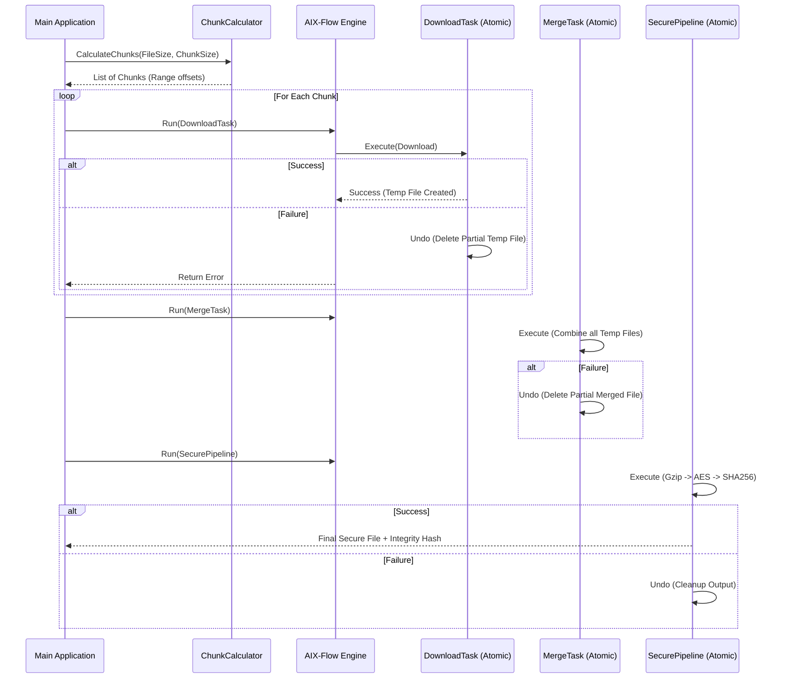

# Concurrent Chunk Downloader: Architectural Contract

This document defines the interaction contract for the Chunk Downloader. All implementations must strictly adhere to the following logic to ensure atomicity and side-effect isolation.

## 1. System Design Principles
- **Isolate Side Effects**: Downloads are initially written to temporary chunk files (`chunk_n.tmp`). The production file is only touched during the `MergeTask` phase.
- **Atomic Operations**: Each download, merge, and post-processing step is encapsulated as an `aixflow.Task`.
- **Automatic Rollback**: If a task fails, its corresponding `Undo()` is invoked to clean up temporary artifacts.

## 2. Sequence Diagram Contract

## 3. Post-Processing Pipeline Contract
- **Compression**: Gzip (standard compression level).
- **Encryption**: AES-256-CTR with random IV prepended to the ciphertext.
- **Integrity Verification**: SHA-256 hash calculated simultaneously during the encryption streaming process.
